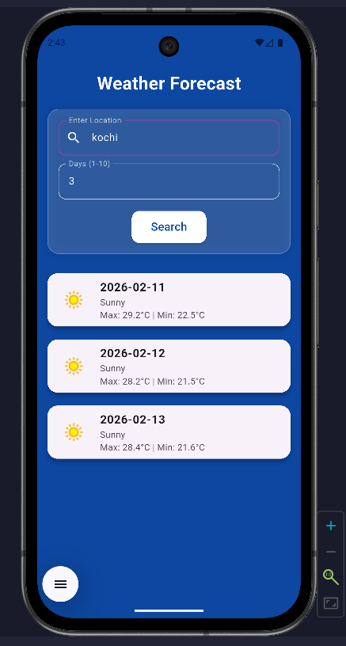
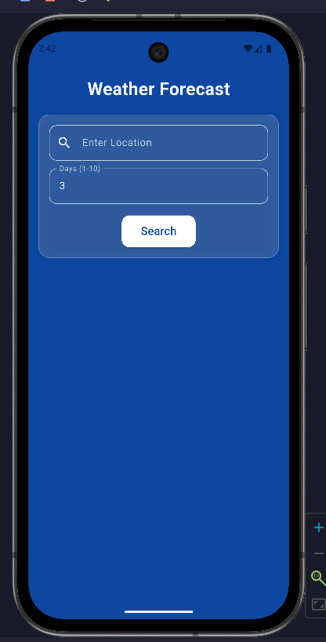

# Weather Forecast App (Flutter REST API)

## Overview
This is a Flutter weather application that fetches real-time weather data from an online REST API and displays the weather information for a selected location.

The project was developed as part of my Flutter learning portfolio to practice API integration, JSON parsing, and asynchronous programming.

## Features
- Fetches real-time weather data from API
- Displays temperature and city information
- Dynamic UI update based on API response
- Loading and error handling
- Clean and responsive UI

## Tech Stack
- Flutter
- Dart
- REST API
- HTTP package
- JSON parsing

## How the App Works
The application sends an HTTP request to the weather API, receives JSON data, parses it, and updates the UI with temperature and location details.

## How to Run
1. Clone this repository
2. Run:
   flutter pub get
3. Start emulator or connect device
4. Run:
   flutter run

## Screenshots

### Weather Result

### Search / Loading

